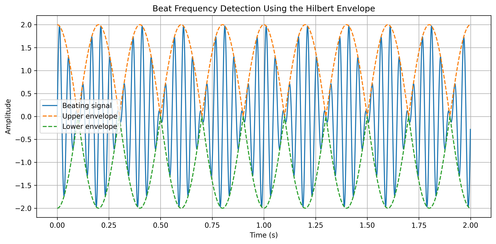
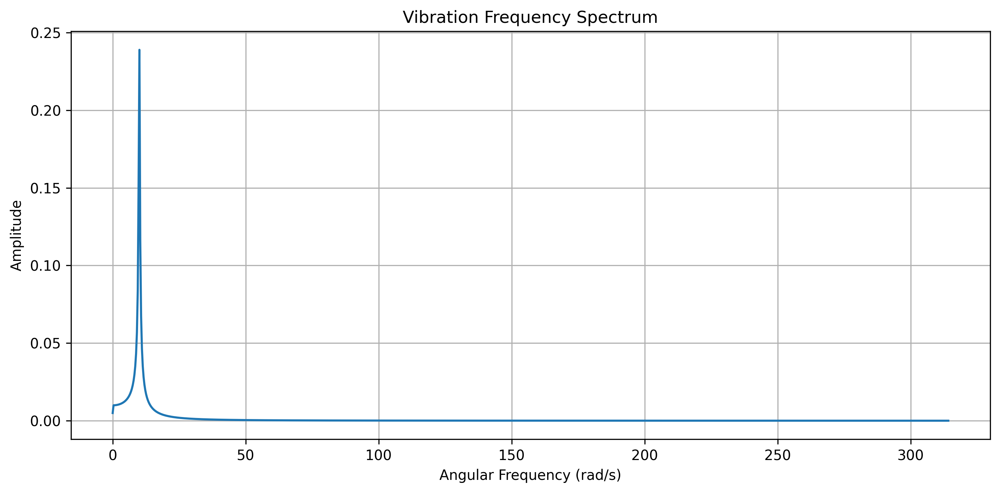
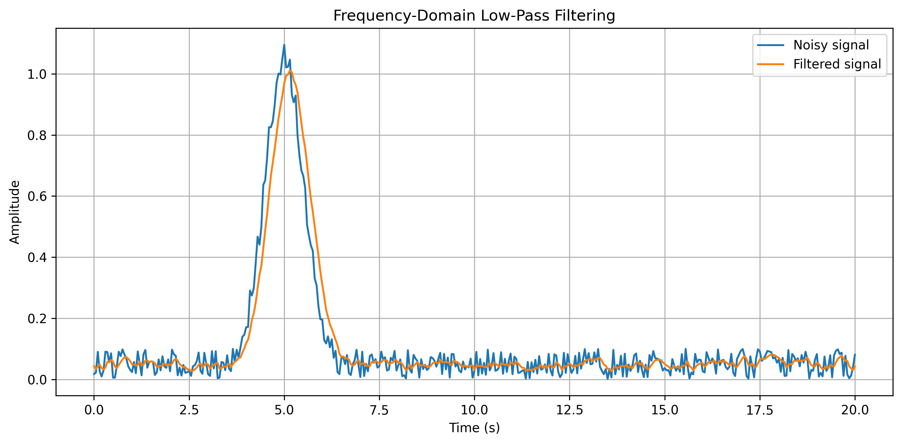
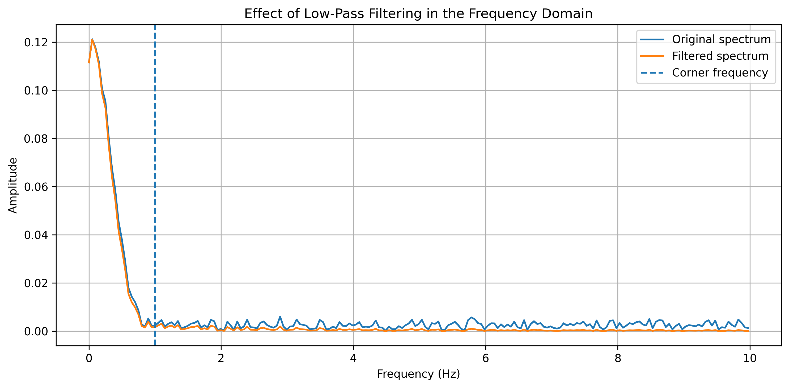
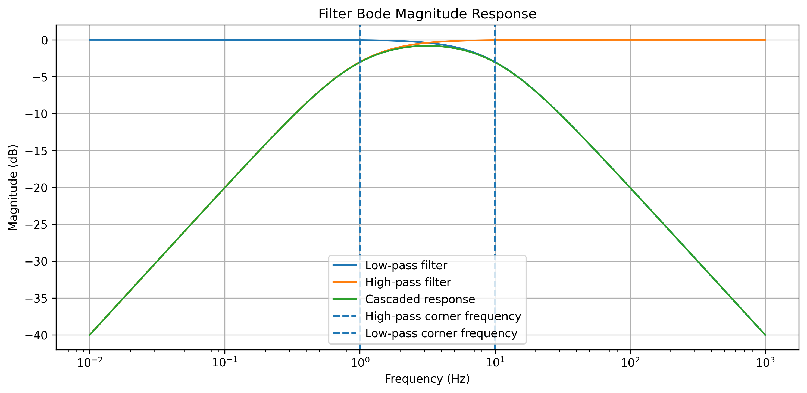

# Signal and Frequency Domain Analysis

A Python repository implementing and applying signal processing and frequency-domain analysis techniques to engineering problems.

The repository covers the Discrete Fourier Transform (DFT), Fast Fourier Transform (FFT), Hilbert transform, frequency-domain filtering, Bode analysis, Fourier series, and vibration spectrum analysis. Core numerical concepts are implemented and verified before being applied to representative signals and engineering datasets.

# Methods

**Discrete Fourier Transform**

The DFT and inverse DFT are implemented directly from their mathematical definitions. The implementations are verified against NumPy's FFT routines and through reconstruction of the original signal.

**FFT Conjugate Symmetry**

For real-valued signals, the negative-frequency components of the Fourier transform can be reconstructed from the positive-frequency components using conjugate symmetry. This property is demonstrated through spectrum and signal reconstruction.

**Single-Sided Amplitude Spectrum**

A reusable function converts a real-valued time-domain signal into its single-sided amplitude spectrum using the FFT.

**Hilbert Transform**

The analytic signal is constructed in the frequency domain using the Hilbert transform. The resulting envelope is used to analyse amplitude modulation and beating signals.

**Frequency-Domain Filtering**

First-order low-pass and high-pass filter responses are implemented and applied directly to Fourier-domain signals. The filtered spectrum is transformed back into the time domain using the inverse FFT.

**Bode Analysis**

Magnitude and phase responses are calculated for first-order low-pass and high-pass filters. Cascading the two filters demonstrates the frequency response of a combined filtering system.

**Fourier Series**

A truncated Fourier series is used to approximate a square wave and demonstrate how increasing the number of harmonics improves the approximation.

# Engineering Applications

**Beat Frequency Detection**

Two nearby sinusoidal components are combined to produce a beating signal. The dominant frequencies are identified from the frequency spectrum and the amplitude envelope is obtained using the Hilbert transform.



**Vibration Spectrum Analysis**

Measured vibration displacement data are transformed from the time domain into the frequency domain to identify the dominant vibration frequency.



**Frequency-Domain Noise Filtering**

A noisy measured signal is transformed into the frequency domain and passed through a first-order low-pass filter. The filtered spectrum is then reconstructed in the time domain.





**Filter Frequency Response**

The magnitude response of low-pass, high-pass, and cascaded filters is evaluated over a logarithmic frequency range.



# Verification and Testing

The numerical implementations are checked using analytical properties, established NumPy routines, and automated tests.

Verification includes:

- Manual DFT compared against `numpy.fft.fft`
- Manual inverse DFT reconstruction of the original signal
- Even- and odd-length conjugate-symmetry reconstruction
- Known-frequency sinusoidal signals used to verify spectral peak detection
- Hilbert envelope verified using a constant-amplitude sinusoid
- Beat-frequency detection verified using known frequency pairs
- Low-pass and high-pass responses checked at their corner frequencies

The repository uses both unit tests and JSON-driven functional tests.

**Unit Tests**

The `tests/` directory contains tests for individual signal-processing and frequency-analysis functions. These verify numerical accuracy, mathematical properties, input validation, and error handling.

Run the unit tests using:

```bash
python -m unittest discover -s tests -v
```

**Functional Tests**

The `functional_tests/` directory contains higher-level tests using inputs, expected outputs, and numerical tolerances defined externally in `test_cases.json`.

The functional tests verify the complete behaviour of:

- Discrete Fourier Transform
- Inverse Discrete Fourier Transform
- Single-sided amplitude spectrum calculation
- Hilbert-transform envelope extraction
- Beat-frequency detection
- Low-pass and high-pass filter responses

Run the functional tests using:

```bash
python -m unittest functional_tests.test_functional -v
```

Run all discoverable tests using:

```bash
python -m unittest discover -v
```

# Repository Structure

```text
Signal-and-Frequency-Domain-Analysis/
├── data/
│   ├── Noisy.txt
│   └── Vibration.txt
├── examples/
│   ├── beat_frequency_hilbert.py
│   ├── bode_filter_response.py
│   ├── dft_reconstruction.py
│   ├── fft_conjugate_symmetry.py
│   ├── fourier_series.py
│   ├── frequency_domain_filtering.py
│   └── vibration_spectrum.py
├── frequency_analysis/
│   ├── __init__.py
│   └── frequency_analysis.py
├── functional_tests/
│   ├── __init__.py
│   ├── test_cases.json
│   └── test_functional.py
├── outputs/
│   ├── beat_frequency_hilbert.png
│   ├── bode_magnitude_response.png
│   ├── bode_phase_response.png
│   ├── dft_reconstruction.png
│   ├── fft_conjugate_symmetry.png
│   ├── fourier_series.png
│   ├── frequency_domain_filtering.png
│   ├── frequency_domain_filtering_spectrum.png
│   ├── vibration_signal.png
│   └── vibration_spectrum.png
├── signal_processing/
│   ├── __init__.py
│   └── signal_processing.py
├── tests/
│   ├── __init__.py
│   ├── test_frequency_analysis.py
│   └── test_signal_processing.py
├── .gitignore
├── main.py
├── README.md
└── requirements.txt
```

# Running the Analysis

A demonstration of the main signal and frequency-domain analysis methods can be run using:

```bash
python main.py
```

Individual engineering examples can be run from the repository root using:

```bash
python -m examples.dft_reconstruction
python -m examples.fft_conjugate_symmetry
python -m examples.beat_frequency_hilbert
python -m examples.vibration_spectrum
python -m examples.frequency_domain_filtering
python -m examples.bode_filter_response
python -m examples.fourier_series
```

Generated figures are saved in the `outputs/` directory.

# Requirements

- Python 3
- NumPy
- Matplotlib

Install the required packages using:

```bash
pip install -r requirements.txt
```

# Purpose

This repository was developed to consolidate signal-processing and frequency-domain analysis techniques into a structured and reusable Python codebase.

The focus is on connecting the underlying numerical methods to engineering applications while verifying their behaviour through analytical properties, reference implementations, unit tests, and JSON-driven functional tests.